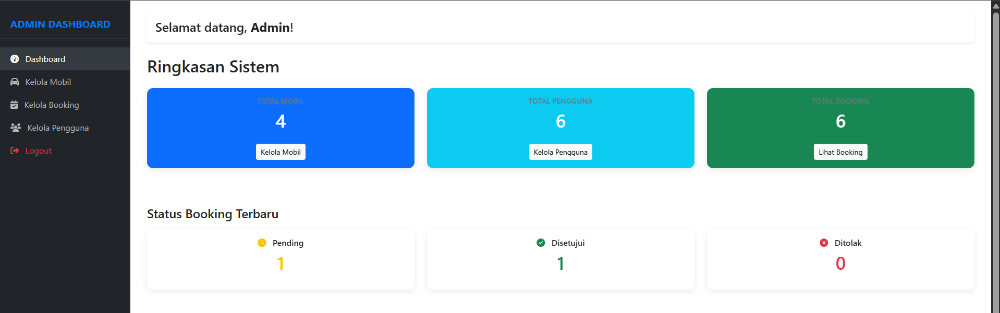
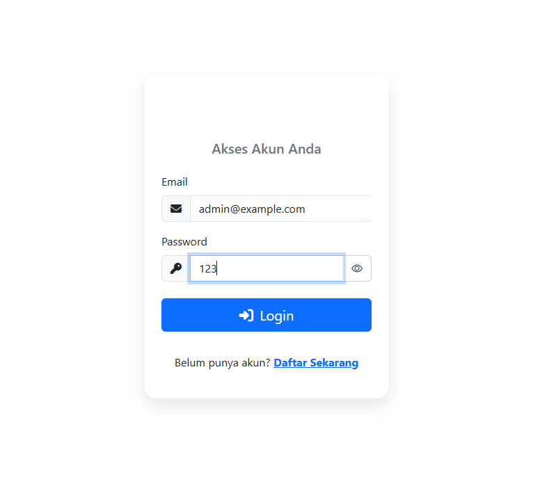
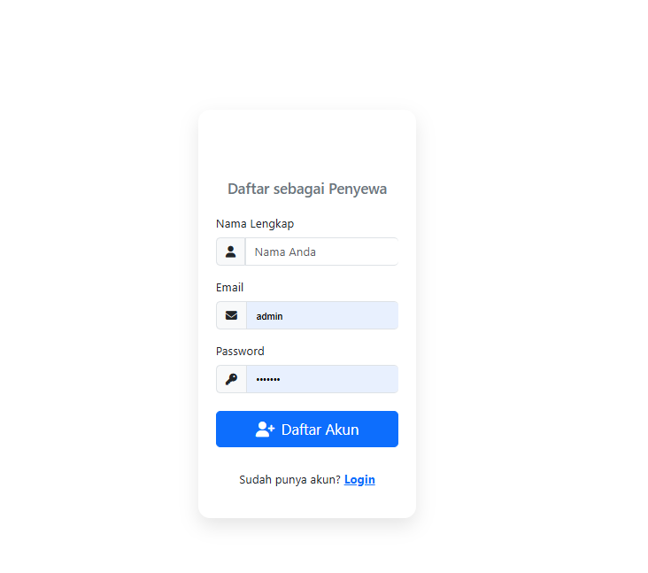
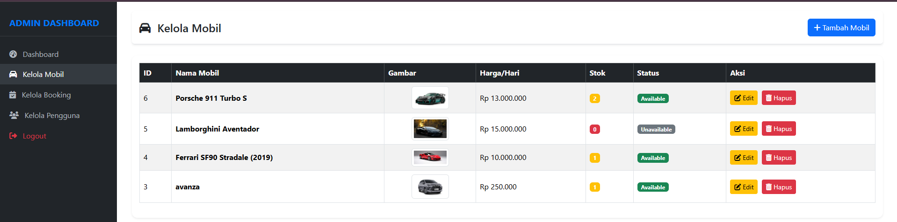
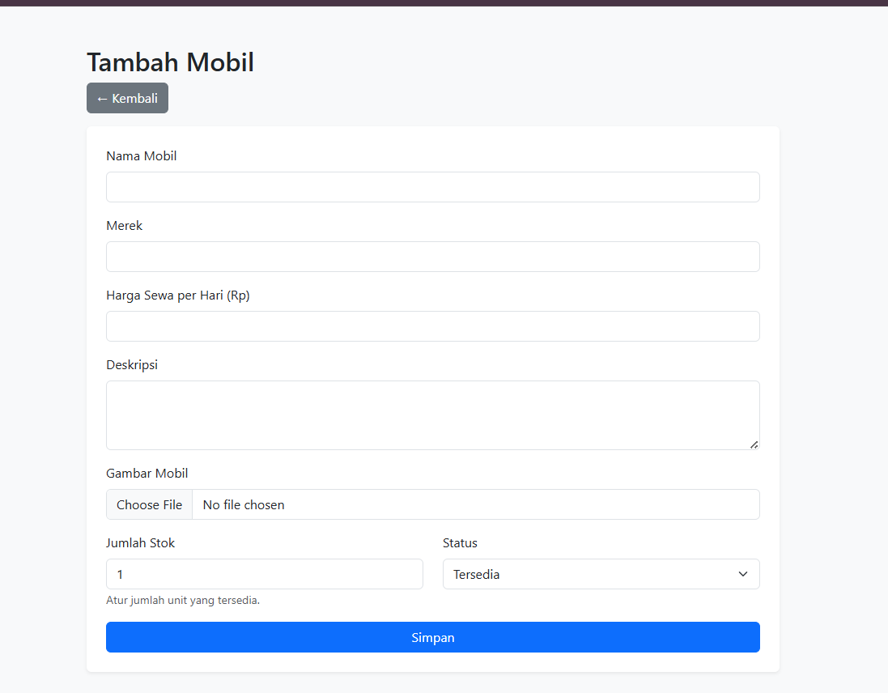
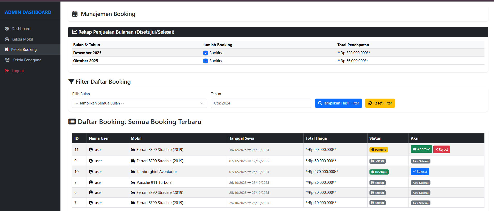
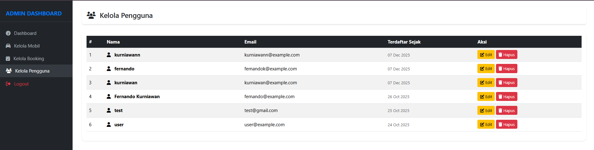
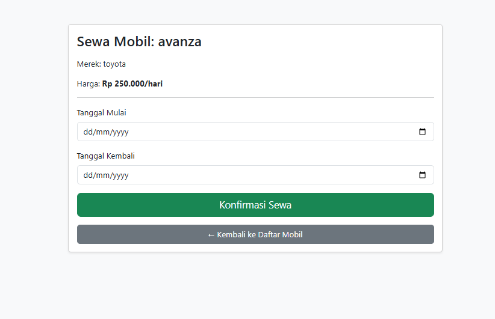
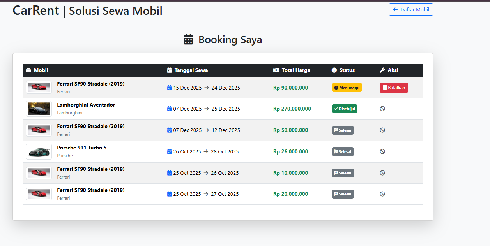

## Akun Demo
ADMIN
- **Email:** admin@example.com
- **Password:** 123

User
- **Email:** user@example.com
- **Password:** 123

Sistem Informasi Rental Mobil Berbasis Web merupakan aplikasi yang dirancang untuk membantu pengelolaan layanan penyewaan mobil secara terstruktur dan terkomputerisasi. Aplikasi ini menyediakan dashboard administrator untuk mengelola data mobil, pengguna, serta memantau proses booking secara real-time.

Sistem ini mendukung dua peran utama, yaitu **Administrator** dan **Pengguna**. Administrator bertugas mengelola data mobil, pengguna, dan booking, sedangkan pengguna dapat melakukan pemesanan mobil melalui sistem. Dengan adanya sistem ini, proses operasional rental mobil menjadi lebih efisien, tertata, dan mudah dikelola.

### Login

Halaman login digunakan sebagai pintu masuk ke Sistem Informasi Rental Mobil. Pada halaman ini, pengguna diminta untuk memasukkan **email** dan **password** yang telah terdaftar untuk melakukan proses autentikasi. Sistem akan memverifikasi data yang dimasukkan dan mengarahkan pengguna ke dashboard sesuai dengan peran akun, baik sebagai **Administrator** maupun **Pengguna**.

Fitur login ini bertujuan untuk menjaga keamanan sistem agar hanya pengguna yang berwenang yang dapat mengakses dan mengelola data di dalam aplikasi.

## 📝 Halaman Register

Halaman Register digunakan oleh calon pengguna untuk membuat akun baru sebagai penyewa pada Sistem Informasi Rental Mobil. Pada halaman ini, pengguna diminta untuk mengisi data berupa **nama lengkap**, **email**, dan **password** sebagai informasi dasar akun.

Setelah proses pendaftaran berhasil, pengguna dapat melakukan login menggunakan akun yang telah dibuat untuk mengakses fitur penyewaan mobil. Halaman ini bertujuan untuk mempermudah pengguna dalam melakukan pendaftaran secara mandiri sebelum menggunakan layanan yang tersedia di dalam sistem.

### Kelola Mobil

Halaman Kelola Mobil digunakan oleh administrator untuk mengelola data kendaraan yang tersedia dalam sistem rental mobil. Pada halaman ini, admin dapat melihat daftar mobil yang tersimpan dalam bentuk tabel yang menampilkan informasi seperti nama mobil, gambar, harga sewa per hari, jumlah stok, serta status ketersediaan mobil. Selain itu, admin juga dapat melakukan aksi **edit** dan **hapus** data mobil sesuai kebutuhan.

Halaman Tambah Mobil digunakan untuk menambahkan data kendaraan baru ke dalam sistem. Administrator dapat mengisi informasi mobil berupa nama mobil, merek, harga sewa per hari, deskripsi, gambar mobil, jumlah stok, serta status ketersediaan. Data yang telah disimpan akan langsung ditampilkan pada halaman Kelola Mobil dan dapat digunakan dalam proses booking.

### Kelola Booking

Halaman Kelola Booking digunakan oleh administrator untuk mengelola seluruh data pemesanan mobil yang diajukan oleh pengguna. Pada halaman ini, admin dapat melihat daftar booking terbaru beserta informasi pengguna, mobil yang disewa, tanggal sewa, total harga, serta status pemesanan.

Selain itu, sistem menyediakan fitur **rekap penjualan bulanan** yang menampilkan jumlah booking dan total pendapatan berdasarkan bulan dan tahun, serta fitur **filter booking** untuk memudahkan pencarian data berdasarkan periode tertentu.

Administrator dapat melakukan beberapa aksi pada data booking, yaitu:
- **Approve**: menyetujui pengajuan booking mobil yang diajukan oleh pengguna.
- **Reject**: menolak pengajuan booking apabila tidak memenuhi ketentuan atau mobil tidak tersedia.
- **Selesai**: mengonfirmasi bahwa proses sewa mobil telah selesai dan transaksi telah ditutup.

### Kelola Pengguna (Admin)

Halaman Kelola Pengguna digunakan oleh administrator untuk mengelola data pengguna yang terdaftar dalam Sistem Informasi Rental Mobil. Pada halaman ini, admin dapat melihat daftar pengguna beserta informasi nama, alamat email, serta tanggal pendaftaran akun.

Administrator juga dapat melakukan aksi **edit** untuk memperbarui data pengguna dan **hapus** untuk menghapus akun pengguna dari sistem. Fitur ini bertujuan untuk memastikan data pengguna tetap terkelola dengan baik serta mendukung keamanan dan keteraturan dalam penggunaan sistem.

### Halaman User – Daftar Mobil

Halaman Daftar Mobil merupakan halaman utama yang ditampilkan kepada pengguna setelah berhasil login ke dalam Sistem Informasi Rental Mobil. Pada halaman ini, pengguna dapat melihat daftar mobil yang tersedia untuk disewa lengkap dengan informasi nama mobil, merek, harga sewa per hari, serta status ketersediaan kendaraan.

Pengguna dapat melakukan aksi **Sewa Sekarang** pada mobil yang masih tersedia. Apabila stok mobil telah habis, sistem akan menampilkan keterangan **Stok Habis** dan tombol penyewaan tidak dapat digunakan. Halaman ini dirancang untuk memudahkan pengguna dalam memilih mobil sesuai kebutuhan secara cepat dan informatif.

### Form Sewa Mobil

Halaman Form Sewa Mobil digunakan oleh pengguna untuk melakukan pemesanan mobil yang telah dipilih. Pada halaman ini, sistem menampilkan informasi mobil seperti nama mobil, merek, dan harga sewa per hari sebagai referensi sebelum melakukan penyewaan.

Pengguna diminta untuk mengisi **tanggal mulai sewa** dan **tanggal kembali**. Setelah data diisi dengan benar, pengguna dapat menekan tombol **Konfirmasi Sewa** untuk mengajukan booking ke sistem. Selain itu, tersedia tombol **Kembali ke Daftar Mobil** untuk membatalkan proses penyewaan dan kembali ke halaman sebelumnya.

### Booking Saya (User)

Halaman Booking Saya digunakan oleh pengguna untuk melihat riwayat pemesanan mobil yang pernah dilakukan. Pada halaman ini, pengguna dapat memantau informasi booking seperti mobil yang disewa, tanggal sewa, total harga, serta status pemesanan.

Status booking yang ditampilkan meliputi **Menunggu**, **Disetujui**, dan **Selesai**. Selama status masih **Menunggu**, pengguna dapat membatalkan pemesanan. Setelah booking disetujui atau dinyatakan selesai, data booking hanya dapat dilihat sebagai riwayat tanpa dapat dilakukan perubahan. Halaman ini membantu pengguna dalam memantau proses dan histori penyewaan mobil secara transparan.
